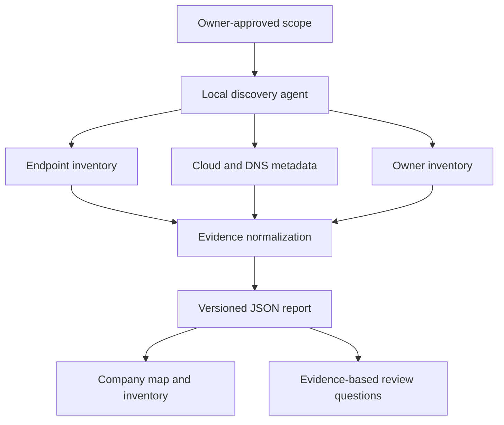

# Glinx's first sensing layer

Glinx's wider vision is a persistent company self-model: organizational identity, operating condition, and memory over time. This increment builds the beginning of the evidence plane and Company Connectome. Original source systems remain authoritative.

The Python agent is the collector and orchestrator. It runs only enabled sources, normalizes products, preserves provenance, records each source's result, and atomically writes a local report with restrictive Unix permissions. A local HTTP server exposes only the dashboard's fixed assets and a selected report on loopback. It cannot start scans or accept uploads remotely.

The same dependency-free web interface runs locally and as a hosted private demonstration. Imported reports remain in tab memory; there is no hosted ingestion backend, analytics SDK, automatic report upload, or browser persistence. The hosted artifact contains only fictional evidence.

## Components

| Module | Responsibility |
|---|---|
| `glinx_discovery/cli.py` | Explicit scope, orchestration, per-source failure status, local output |
| `glinx_discovery/collectors.py` | Endpoint, mail DNS, Graph, HTTPS, and CSV acquisition |
| `glinx_discovery/catalog.py` | Conservative known-product rules |
| `glinx_discovery/model.py` | Stable IDs, evidence records, normalization, report contract |
| `glinx_discovery/server.py` | Fixed-path local dashboard and report serving |
| `dist/model.js` | Import validation, filters, metrics, inventory rules, CSV escaping |
| `dist/app.js` | Company map, evidence panels, inventory, and sample replay |

## Evidence semantics

- **Observed** means an installation or identity source returned a corresponding record. It does not prove activity or business criticality.
- **Reported** means an owner supplied a statement about a system or integration.
- **Inferred** means a fingerprint or domain record suggests a product/provider.

Scores from 0 to 100 express a fixed rule's detection strength. They are not calibrated probabilities. Every evidence record retains its own state even if another source supports a stronger system-level state. No integration is inferred from two systems being present together.

## Boundaries

No subnet sweeps, port-range scans, privilege escalation, configuration writes to business systems, automatic data upload, LLM calls, or actions in company applications are performed. Microsoft authentication necessarily requests a token; discovery API operations read metadata. The code honors system TLS verification, bounds network requests, does not follow redirects, and validates Microsoft pagination URLs before forwarding a bearer token.

The agent is a manually invoked process, not a managed endpoint service. Linux inventory omits unmatched OS packages; macOS scanning is shallow; Windows enumeration covers accessible uninstall entries and not every possible application source. HTTPS discovery requires a named URL and cannot find every internal application automatically. Graph has a 100-page bound and the global-cloud endpoint only.

## Subsequent architecture

The current stage-two proposal is documented in [Stage two: a persistent company model](STAGE-2-ARCHITECTURE.md). Its small implementation sequence is local company memory, native source identities, one ERP connector, and one operational view. The proposal includes acceptance criteria for the first coding chunk; these capabilities are not implemented by the documentation checkpoint. Broader source coverage remains follow-on work.

The next pilot should add one high-value native ERP connector and one broader identity/MDM source, stable tenant/resource identities, authenticated enrollment, protected credential storage, incremental scans, deletion/change reconciliation, and audit history. Then introduce native SQL/document/graph evidence routing and permission-aware retrieval. PostgreSQL/Qdrant/MinIO and local inference can support that later evidence and memory layer; they are not needed to run this sensing demo.

Do not equate this prototype's deterministic inventory findings with the planned Understand/Decide/Act/Learn stages. Business-content ingestion, human approvals for actions, and tenant isolation need their own implementation and validation.
