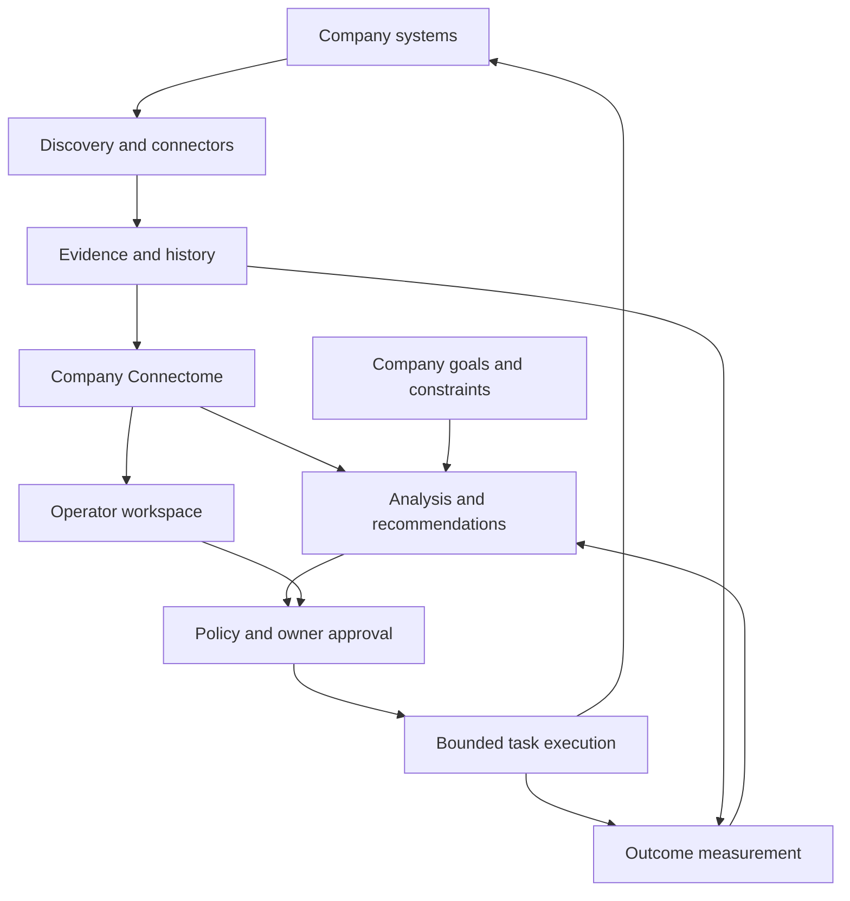

# Glinx stage two: a persistent company model

Status: architecture and implementation sequence. Stage 2A is now implemented in the [company memory increment](STAGE-2-DEMO.md); the remaining capabilities below are the roadmap.

Baseline: [main at c424470](https://github.com/dennybrig/Glinx.ai/tree/c4244704c3ff4fb8ef686b8022b402bae0329d1b), inspected September 10, 2026.

Stage one asks **which systems can we identify?** Stage two should answer **what do we know about this company, what changed, and what evidence supports that view?** It extends Sense into the first bounded part of Understand. The eventual self-improvement loop requires explicit goals, authorized actions, and measured outcomes.

## 1. Build on the existing code

| Existing component | Reuse | Gap to address |
| --- | --- | --- |
| `glinx_discovery/collectors.py` | Enabled, bounded discovery sources | Native system identities and operational ERP records |
| `glinx_discovery/model.py` | Evidence states, normalization, JSON reports | Persistent company identity and history; product-name IDs currently combine installations |
| `glinx_discovery/cli.py` | Explicit scope, per-source outcomes, local reports | Explicit import into company memory |
| `dist/model.js` and `dist/app.js` | Inventory, map, evidence drilldowns, report import | Current/past views and source freshness |
| `glinx_discovery/server.py` | Fixed assets and a selected local report | A future authenticated API is a separate component |

The browser accepts report contract `1.0` exactly. Its current insights are deterministic review questions. The hosted demo serves static files from `dist/`; it has no Python backend or shared database. Treat these as working foundations, with the wider cognition and action layers still proposed.

## 2. Overall architecture

The original five layers remain: company organs → connector fabric → evidence plane → Company Connectome → Glinx cognition. Add an owner-defined company charter and an explicit action/measurement loop around them.



| Component | Responsibility | Delivery stage |
| --- | --- | --- |
| Company charter | Purpose, objectives, KPI definitions, constraints, accountable owners | Begin with a small owner-supplied profile in stage two |
| Connector fabric | Explicitly scoped reads from endpoints and business applications; source status and checkpoints | Existing discovery plus one native ERP connector in stage two |
| Evidence plane | Retain observations, origin, timestamps, scope, and revision history | Stage two |
| Company Connectome | Link systems, people/roles, processes, metrics, and relevant business entities to their evidence | Systems first; expand for one process in stage two |
| Cognition | Calculate metrics, retrieve permitted evidence, form hypotheses and explain recommendations | One bounded operational view in stage two; broader diagnosis later |
| Action controller | Assign agents specific tasks with approved tools, budgets, permissions, expiry, and stop conditions | Stage three |
| Learning | Compare outcomes with baselines; version lessons and revised hypotheses | Stage three, after an actual approved intervention |

The Connectome is the company's connected model. Graph-shaped entities and relationships can initially live in ordinary database tables. Each relationship needs its own evidence; discovering two products does not establish an integration.

The charter defines what improvement means. For a manufacturer, delivery, margin, quality, safety, and working capital can conflict. Leadership supplies priorities and constraints. Glinx can propose a revision, but an agent cannot silently change its own objective or authority.

## 3. Keep the first implementation small

Use a **modular Python application**: one codebase with separate responsibilities, initially invoked locally. Preserve `glinx_discovery` and add a sibling `glinx_company` package when implementation begins.

| Proposed module | Purpose |
| --- | --- |
| `glinx_company/contracts.py` | Versioned company, import, identity, and evidence contracts |
| `glinx_company/importer.py` | Validate existing reports and record their provenance |
| `glinx_company/store.py` | Transactions, persisted reports, and company-scoped reads |
| `glinx_company/projection.py` | Rebuild the current view and compare snapshots |
| `glinx_company/connectors/` | Later native ERP adapter behind the same contracts |

Start with one local SQLite database per company and explicit company/scope IDs in stored records. Python's [`sqlite3` documentation](https://docs.python.org/3/library/sqlite3.html) describes disk-based storage without a separate database server; verify that module is available on supported Python installations. This fits the existing lightweight local workflow.

Keep database access behind the store interface. A later shared service can use a private Python API, background connector worker, and PostgreSQL, with authentication, tenant-scoped authorization, and tested isolation. PostgreSQL [row security](https://www.postgresql.org/docs/current/ddl-rowsecurity.html) can provide an additional enforcement layer; privileged roles require separate care. Adding a company ID alone does not implement isolation.

The Sites frontend would call that service over HTTPS; the current static hosting does not execute Python. Select the backend deployment and authentication model when a shared pilot is required. Dedicated graph/vector databases, a message broker, and multiple services remain conditional on demonstrated workloads. The first increment needs no LLM.

## 4. The data model

| Record | Essential information |
| --- | --- |
| Company profile | Stable company ID, display name, purpose, owners, versioned objectives/constraints |
| Collection scope | Company ID, scope ID, configured sources/instances, boundary revision |
| Import/run | Internal run ID, source schema, digest, collected/imported times, per-source completion |
| Product/system identity | Product classification separate from a tenant/installation/resource identity |
| Observation | Subject, source/native reference, value or claim, evidence state, observation time, source update time when available |
| Relationship claim | Typed direction, endpoints, supporting observations, reported/observed/inferred state |
| Projection | Rebuildable current view with first/last seen, unresolved conflicts, and links to history |

For new native records, identity is scoped by company + connector instance + provider tenant/environment + resource type + source-native ID. Preserve provider identifier casing and encode tuples unambiguously; do not reuse the current lowercasing, delimiter-joined product hash for native IDs.

Keep `observed`, `reported`, and `inferred` per claim. Keep detection scores as rule strengths, not probabilities. A reported owner and a contradictory reported owner remain two claims until a recorded resolution. Imported files are supplied evidence, not authenticated source testimony.

Retain observation revisions during the configured retention period and rebuild projections from them. Corrections add superseding claims; explicit retention/deletion operations remove payloads as required. Source content is data, never authority to change tools, policies, or goals. Future retrieval and derived outputs inherit source access restrictions.

## 5. First coding chunk: 2A — local company memory

**User outcome:** import two discovery reports, close and reopen Glinx, and inspect what changed with the original evidence still available.

Implement only the company/scope record, persisted report imports, and a comparison command. A small owner-supplied company profile starts the charter; executable goal optimization comes later.

Commands for the implemented first slice:

```text
glinx company init --name "Alder Forge" --db alder.db
glinx company import --db alder.db --scope-id pilot-workstation scan-a.json
glinx company import --db alder.db --scope-id pilot-workstation scan-b.json
glinx company diff --db alder.db --scope-id pilot-workstation
```

Compatibility rules:

- Leave report `1.0`, existing scan commands, and browser imports working. Give the company store its own schema/migrations. A later richer connector envelope has a separate version.
- Require the company and collection scope at import. Never derive company identity from the report's display name. Changed collection boundaries require a new scope revision.
- Deduplicate the same import by company, scope, and a digest of canonicalized report JSON. Allocate a separate internal run ID: the current `scan_id` can collide for same-second scans with equal company/count.
- Preserve legacy product-level aggregates as unresolved identities. Information already merged by v0.1 cannot be recovered by renaming IDs. Native instance resolution is the next increment.
- Compare reports only within a compatible scope. Ignore collection timestamps when detecting semantic changes. Distinguish a changed claim from a newly refreshed observation.
- A missing record means **not seen in this scan**. A failed/disabled source means **visibility unavailable**. Neither means a system was deleted. Only an authoritative deletion event or an explicit owner resolution can establish removal.
- Keep `demo` and `live` histories separate; reject mixed comparisons. Retain conflicting claims and explicit limitations.

Acceptance criteria for the implementation PR:

| Scenario | Required result |
| --- | --- |
| Reimport the same report; restart the process | One logical import, retained evidence and state |
| Two imports with a colliding legacy scan ID | Both retained when their content differs |
| Same product in separate companies or collection scopes | No automatic cross-boundary merge |
| New system, changed owner, refreshed timestamp | Report the first two changes; timestamp-only refresh is not a business change |
| A source fails or returns no matching record | Preserve history and distinguish unavailable coverage from not seen |
| Malformed report or failed transaction | Reject atomically; retain the previous valid state |
| Demo/live mismatch or different scope revision | Reject comparison with a clear explanation |
| Existing scan/demo and report import | Remain compatible with contract `1.0` |

Use synthetic Alder Forge fixtures. Keep database files and real reports outside `dist/` and out of Git. Update the explicit package list in `pyproject.toml` when adding `glinx_company`; preserve `setup.py`'s dashboard build hook and validate the installed wheel as well as the checkout.

## 6. Subsequent small chunks

| Chunk | Deliverable | Completion criterion |
| --- | --- | --- |
| 2B: source identity | Connector-instance and native-resource contracts; explicit legacy mappings | Two installations of one product remain distinct; mappings retain their evidence |
| 2C: one ERP | Read-only native metadata, then one explicitly approved operational dataset | Tenant/environment verified; pagination, retry, checkpoint, and partial-run behavior demonstrated |
| 2D: one operating view | Map the order-fulfillment process and show overdue open order lines, owners, source freshness, and evidence | A user can reproduce the metric from its source records and understand missing coverage |

Epicor is a candidate because the existing fictional demo includes it; the pilot's actual ERP product, version, environment, and available API are not established. Select those before implementing its adapter. Broader identity/MDM and additional business systems follow the first useful ERP result.

For the first order view, define what promised date means, the reporting timezone, line status, open quantity, site scope, and cancellations before calculating the metric. Snapshot age must be visible. Overdue orders alone do not prove a production bottleneck or its cause. Job, inventory, and shipment evidence can support later explanations.

## 7. How recursive improvement eventually works

After stage two is trustworthy: define a baseline → propose a bounded intervention → apply policy and owner approval → execute → measure → retain a lesson or revise the hypothesis. Use a comparison window and record confounding changes; a better KPI after an intervention is not automatically proof that it caused the improvement.

An execution request must carry its evidence references, approved plan/version, target resources, permitted tools, cost/time limits, expiry, and success/stop criteria. Enforce these in the action controller and recheck authority immediately before execution. Use idempotency and reconciliation for ambiguous failures rather than blindly repeating business writes. Define rollback or compensating steps; actions without a reversal path need explicit treatment before approval.

Outcome observations return through the evidence plane. The learning component can propose revised rules or procedures with versioned evaluations; production changes and changes to objectives remain governed. That is the path from remembering the company to improving it repeatedly.

## Checkpoint validation

Reviewed against the repository's discovery code, report validator, connector instructions, packaging configuration, and hosted static configuration. The original architecture checkpoint contained documentation only. Stage 2A implementation and validation are documented in [the demo guide](STAGE-2-DEMO.md). No live ERP validation has been performed.

